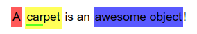
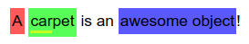

# Text Marker

[](dist/text-marker.js)
[](https://www.npmjs.com/package/text-marker.js)
[](LICENSE)

_A lightweight, zero dependency JavaScript text marking library._



With `text-marker.js`, it is possible to mark/highlight text based on character indexes of a string. This is very efficient for database storage.


## Installation

```bash
npm install text-marker.js
```


## Usage
The string `A carpet is an awesome object!` can be considered an array of characters:

```
0  1  2  3  4  5  6  7  8  9  10 11 12 13 14 15 16 17 18 19 20 21 22 23 24 25 26 27 28 29
A  ·  c  a  r  p  e  t  ·  i  s  ·  a  n  ·  a  w  e  s  o  m  e  ·  o  b  j  e  c  t  !
```

If one would like to mark `A`, `carpet`, `car` and `awesome object` as seen in the image above, the following indexes need to be used:

```
[0, 1]     -> A
[2, 8]     -> carpet
[2, 5]     -> car
[15, 29]   -> awesome object
```

_Note the order of `car` and `carpet`. Because `car` is marked after `carpet`, `car` is layered on top._

The markings in the image above can be produced with the following code:

```js
const text = 'A carpet is an awesome object!';

const textMarker = new TextMarker(text);
textMarker.addMarking([0, 1], '#f00');
textMarker.addMarking([2, 8], 'yellow');
textMarker.addMarking([2, 5], 'rgb(0, 255, 0)');
textMarker.addMarking([15, 29], 'rgba(0, 0, 255, .65)');

const formattedText = textMarker.getText();

document.getElementById('example-text').write(formattedText);
```

The HTML that the code would generate:

```html
<mark class="tm-mark" style="--tm-color: #f00">A</mark> <mark class="tm-mark" style="--tm-color: yellow"><mark class="tm-mark" style="--tm-color: rgb(0, 255, 0)">car</mark>pet</mark> is an <mark class="tm-mark" style="--tm-color: rgba(0, 0, 255, .65)">awesome object</mark>!
```

And with the following CSS, the colors could be set:
```css
mark {
    background-color: var(--tm-color);
}
```

_Of course this can be styled any way possible with CSS._

In case of a layered marking where the marking order is switched up, the marking would of course differ:



The following CSS is used to achieve this effect:

```css
mark {
    background-color: var(--tm-color);
    display: inline-block;
    padding: 4px 2px;
}

mark mark {
    background-color: unset;
    border-bottom-width: 3px;
    border-bottom-style: solid;
    border-bottom-color: var(--tm-color);
    padding: 0;
}
```


## Contributing

Contributions are welcome. Feel free to create an issue or send a pull request.


## Security

Found a security vulnerability? Email `security at pedzed.com`.

**NOTE:** This library does not protect against XSS attacks. Be sure to pass colors that are safe.
